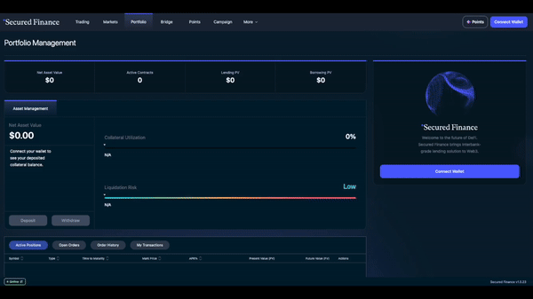

# 🧙‍♂️ Beginners Guide

## Overview 

The User Guides section provides helpful resources for users to understand the platform better. Please refer to our comprehensive tutorials below, or you can check out more from our [blog](https://blog.secured.finance/) which we have prepared during our beta-testing.

## Get started

### How to Deposit

<figure><figcaption>
How to Deposit
</figcaption></figure>

1. Go to Secured Finance WebApps and open [Portfolio Tab](https://app.secured.finance/portfolio/)
2. Connect Your Wallet
3. Click the Deposit Button!!!

### How to Provide Liquidity on Orderbook

<figure><figcaption>
How to Provide Liquidity on Orderbook
</figcaption></figure>

1. Go to Secured Finance[ Trading Apps](https://app.secured.finance/)
2. Set the Condition\
   \- Chose Currency and Maturity\
   \- Lend or Borrow\
   \- Limit order or Market order\
   \- Price (APR)\
   \- Order Amount
3. Click 'Place Order'!!!

## DeFi Apps Onboarding Guide 

This guide will walk you through the steps you need to take to start using DeFi apps. You’ll learn how to set up your MetaMask wallet, connect it to DeFi apps, and get test ETH from Sepolia faucets.

1. [Setting up MetaMask Wallet](https://blog.secured.finance/setting-up-metamask-wallet-417336bfc9ce)
2. [Connecting Your Wallet](https://blog.secured.finance/connecting-your-wallet-c7d3c624d364)
3. [Getting Test ETH from Goerli Faucets](https://blog.secured.finance/getting-test-eth-from-goerli-faucets-c29cce5a17b0) (We have moved to [Sepolia](https://blog.secured.finance/introducing-secured-finance-to-sepolia-4c93c8c3d79c)!)
4. [Getting Test ETH from Sepolia Faucets](https://blog.secured.finance/getting-test-eth-from-sepolia-faucets-5aafd96ccdbe)

## Secured Finance Testnet User Guide 

This guide offers a concise walkthrough of the platform, covering key aspects from preparing test tokens and managing collateral to executing transactions. It also delves into advanced trading strategies that are unique to Secured Finance.

1. [Preparing Test Tokens for Practice](https://blog.secured.finance/preparing-test-tokens-to-play-bd93c7232dde)
2. [Collateral Management](https://blog.secured.finance/collateral-management-e82fa98c53f0)
3. [Trading at Itayose (Pre-Open) Order Book](https://blog.secured.finance/trading-at-pre-open-order-book-itayose-f9ae35663667)
4. [Placing Limit Order](https://blog.secured.finance/placing-limit-order-aeb81431af6f)
5. [Add/Reduce or Unwind Position](https://blog.secured.finance/add-reduce-or-unwind-position-266633e74978)

