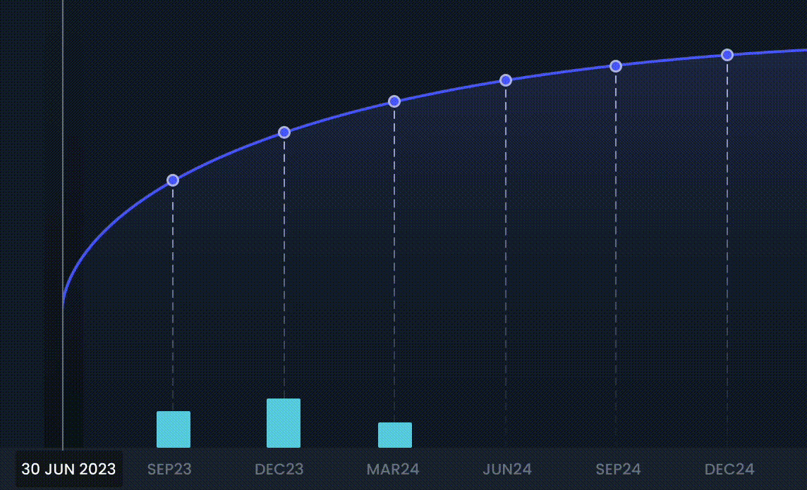

# ♻️ Auto-Rolling

In traditional finance, bond redemption at maturity requires manual reinvestment, which can be cumbersome. Secured Finance, however, has integrated an auto-roll feature into its protocol, streamlining the reinvestment process for users. This feature automatically reinvests matured loans into the nearest 3-month bucket, offering several key advantages:

### **Mitigation of Reinvestment Risk**

Reinvestment risk, the possibility of not finding similar reinvestment conditions at maturity, is a common concern with fixed-term investments. The auto-roll feature mitigates this risk by rolling over positions to the nearest market at a close-to-mid price.

### **Cost Efficiency**

By eliminating the need to find another counterparty on the order book for reinvestment manually, the auto-roll feature reduces operational costs. This not only results in cost savings for users but also helps maintain the total value locked (TVL) in the protocol.

### **Continuous Growth**

The auto-roll feature ensures a seamless reinvestment process, fostering continuous growth for users and enhancing the overall value proposition of the Secured Finance platform.

<figure><figcaption>
Auto-Roll: Automatic reinvestment of matured loans into the nearest 3-month bucket
</figcaption></figure>

In essence, the auto-roll feature is designed to provide an easy, efficient, and smooth reinvestment experience, contributing to the overall user-friendliness of the Secured Finance platform.

