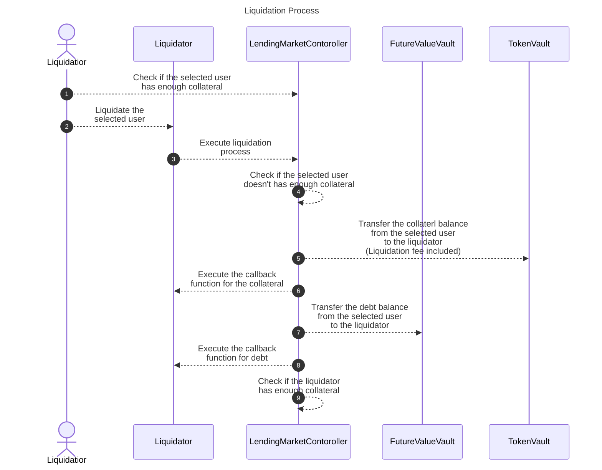

# ✏️ How Liquidation Works

First of all, it is necessary to identify the target user through off-chain actions before executing liquidation. The function `getCoverage()` is used for this purpose. A user becomes a target for liquidation if this function returns a value of `8000` or higher. For more details, refer to the documentation at [TokenVault Documentation](https://github.com/Secured-Finance/contracts/blob/develop/docs/protocol/TokenVault.md#getcoverage).

To execute with liquidation, you must specify the currency of the collateral to be received, the currency of the debt to be liquidated, and its maturity. This is done by calling the function `executeLiquidationCall()`. To maximize the profit of the liquidation in the case that users have collateral or debt in multiple currencies, you need to estimate each case and choose one of them through off-chain action. For more details of the function, refer to the documentation at [LendingMarketController Documentation](https://github.com/Secured-Finance/contracts/blob/develop/docs/protocol/LendingMarketController.md#executeliquidationcall).

Upon executing this process, the liquidator receives the liquidated debt and the collateral plus a 5% fee. However, if the liquidator's collateral coverage exceeds 80% at the end of the process, this liquidation process will fail.

When executing the liquidation process through a smart contract, functions `executeOperationForCollateral()` for receiving collateral, and `executeOperationForDebt()` for receiving debt, can be set as callback functions. For usage, please refer to the sample contract at [Liquidator Contract](https://github.com/Secured-Finance/contracts/blob/develop/contracts/external/liquidation/Liquidator.sol).

During the liquidation process, these callback functions enable the handling of received collateral by swapping it through external services or unwinding the received debt. The process flow is as follows:

