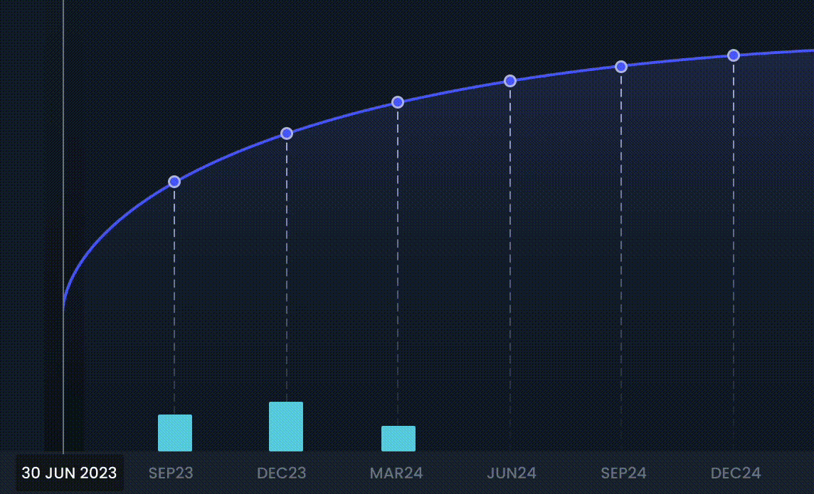

# ♻️ Auto-Rolling

## Overview

Auto-Rolling is an innovative feature in the Fixed-Rate Lending Protocol that streamlines the reinvestment process for users. In traditional finance, bond redemption at maturity requires manual reinvestment, which can be cumbersome. Secured Finance has integrated this auto-roll feature into its protocol, automatically reinvesting matured loans into the nearest 3-month bucket, offering several key advantages.

## What You'll Learn

- How Auto-Rolling mitigates reinvestment risk
- How the automatic reinvestment process works
- How Auto-Rolling contributes to cost efficiency
- How this feature supports continuous growth in the protocol

## Key Components

- [**Price Discovery**](price-discovery-for-auto-rolling.md): How prices are determined during the auto-rolling process
- **Reinvestment Mechanism**: The process of automatically reinvesting matured positions
- **Close-to-Mid Pricing**: The pricing strategy used for auto-rolled positions

## Benefits of Auto-Rolling

### Mitigation of Reinvestment Risk

Reinvestment risk, the possibility of not finding similar reinvestment conditions at maturity, is a common concern with fixed-term investments. The auto-roll feature mitigates this risk by rolling over positions to the nearest market at a close-to-mid price.

### Cost Efficiency

By eliminating the need to find another counterparty on the order book for reinvestment manually, the auto-roll feature reduces operational costs. This not only results in cost savings for users but also helps maintain the total value locked (TVL) in the protocol.

### Continuous Growth

The auto-roll feature ensures a seamless reinvestment process, fostering continuous growth for users and enhancing the overall value proposition of the Secured Finance platform.

<figure><figcaption>
Auto-Roll: Automatic reinvestment of matured loans into the nearest 3-month bucket
</figcaption></figure>

In essence, the auto-roll feature is designed to provide an easy, efficient, and smooth reinvestment experience, contributing to the overall user-friendliness of the Secured Finance platform.

## Related Resources

- [Market Dynamics](../README.md)
- [Price Discovery for Auto-Rolling](price-discovery-for-auto-rolling.md)
- [New Market Listing and Delisting](../new-market-listing-and-delisting/README.md)
