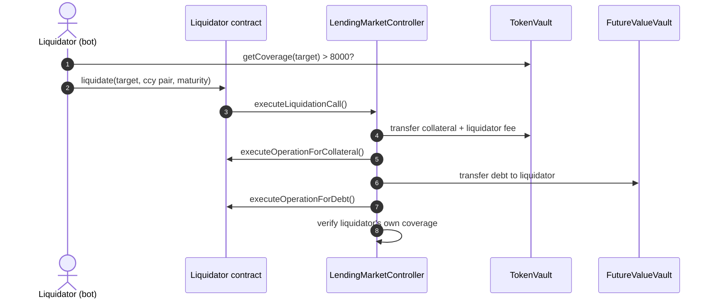

# Liquidator's Guide

Anyone — an EOA or a smart contract — can execute liquidations and earn the liquidator's share of the liquidation fee (currently 5% of the liquidated value; the remaining 2% goes to the protocol Reserve Fund — see [Protocol Parameters](../../protocol-parameters.md)). No registration or permission is required.

## The flow

### 1. Find eligible positions (off-chain)

Call `TokenVault.getCoverage(user)` for candidate accounts. A position is liquidatable when coverage returns **greater than 8000** (= LTV above 80%). Candidate discovery is typically done via the [subgraph](../../../developer-portal/api-reference/fixed-rate-lending-subgraph/README.md) or by indexing protocol events.

### 2. Choose what to liquidate

`LendingMarketController.executeLiquidationCall()` requires you to specify the **collateral currency to receive**, the **debt currency to liquidate**, and its **maturity**. If the target has multiple collateral or debt currencies, estimate each combination off-chain and pick the most profitable — only one combination executes per call.

### 3. Execute — optionally with callbacks

If you liquidate from a contract, two callbacks let you handle the received assets atomically:

* `executeOperationForCollateral()` — e.g. swap the received collateral on a DEX
* `executeOperationForDebt()` — e.g. unwind the received debt position

A reference implementation is available at [`Liquidator.sol`](https://github.com/Secured-Finance/contracts/blob/develop/contracts/external/liquidation/Liquidator.sol).


The call **reverts** if, at the end of the process, the liquidator's own collateral coverage would exceed 80%. Size your liquidations and manage your own book accordingly.


## Economics

For a liquidation repaying debt worth `D`:

* You pay: `D` (in the debt currency, or unwind via callback)
* You receive: collateral worth `D × 1.05` (debt value + 5% liquidator fee)
* Gross profit: `D × 0.05`, minus gas and any swap/unwind slippage

**Example:** target has 10,000 USDC collateral and 8,200 USDC debt (coverage 82%). You liquidate 50% of the debt (4,100 USDC) and receive 4,305 USDC of collateral — 205 USDC gross profit.

## Practical risks

* **Races** — liquidations are competitive; speed and gas strategy matter
* **Price movement** — collateral value can move between detection and execution
* **Callback complexity** — DEX swaps inside callbacks add slippage and failure modes; simulate before deploying

## Related

* [Liquidation](README.md) — mechanism and borrower's view
* [Contracts & Security](../../contracts-and-security.md) — contract addresses
* [Developer Portal](../../../developer-portal/introduction.md) — subgraph and SDK
