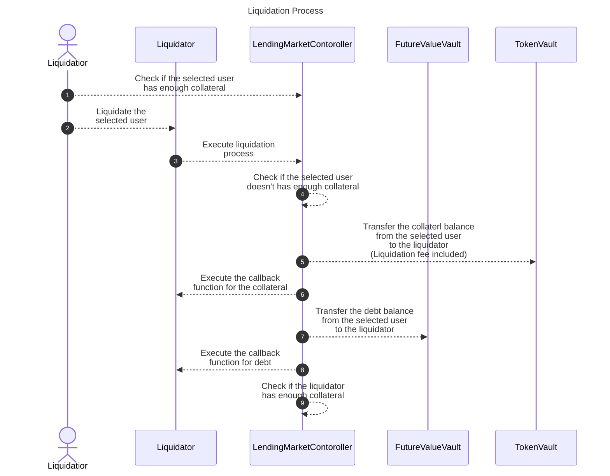

# ✏️ How Liquidation Works

## Overview

The liquidation process in the Fixed-Rate Lending Protocol is a critical mechanism that maintains the system's solvency by ensuring that undercollateralized positions are promptly addressed. This technical guide explains how liquidations work from identification of eligible positions to execution of the liquidation process.

## What You'll Learn

- How to identify positions eligible for liquidation
- How to execute the liquidation process through smart contract functions
- How liquidation fees and penalties are calculated
- How to implement callback functions for handling liquidated assets
- How the liquidation process flow works from start to finish

## How It Works

First of all, it is necessary to identify the target user through off-chain actions before executing liquidation. The function `getCoverage()` is used for this purpose. A user becomes a target for liquidation if this function returns a value of `8000` or higher. For more details, refer to the documentation at [TokenVault Documentation](https://github.com/Secured-Finance/contracts/blob/develop/docs/protocol/TokenVault.md#getcoverage).

To execute with liquidation, you must specify the currency of the collateral to be received, the currency of the debt to be liquidated, and its maturity. This is done by calling the function `executeLiquidationCall()`. To maximize the profit of the liquidation in the case that users have collateral or debt in multiple currencies, you need to estimate each case and choose one of them through off-chain action. For more details of the function, refer to the documentation at [LendingMarketController Documentation](https://github.com/Secured-Finance/contracts/blob/develop/docs/protocol/LendingMarketController.md#executeliquidationcall).

Upon executing this process, the liquidator receives the liquidated debt and the collateral plus a 5% fee. However, if the liquidator's collateral coverage exceeds 80% at the end of the process, this liquidation process will fail.

When executing the liquidation process through a smart contract, functions `executeOperationForCollateral()` for receiving collateral, and `executeOperationForDebt()` for receiving debt, can be set as callback functions. For usage, please refer to the sample contract at [Liquidator Contract](https://github.com/Secured-Finance/contracts/blob/develop/contracts/external/liquidation/Liquidator.sol).

During the liquidation process, these callback functions enable the handling of received collateral by swapping it through external services or unwinding the received debt. The process flow is as follows:



## Examples

### Example 1: Basic Liquidation Process

A user has the following position:
- Collateral: 1 ETH (worth $2,000)
- Debt: 1,500 USDC
- Current collateralization ratio: 133% ($2,000 / $1,500)

If the minimum required collateralization ratio is 150%, this position is eligible for liquidation. A liquidator would:

1. Check the user's coverage using `getCoverage()`, which returns 8500 (85%)
2. Call `executeLiquidationCall()` with:
   - User's address
   - ETH as collateral currency
   - USDC as debt currency
   - Current maturity
3. Receive:
   - The user's debt of 1,500 USDC
   - The user's collateral of 1 ETH plus 5% fee (1.05 ETH total)
4. The liquidator can then sell the 1.05 ETH for approximately $2,100, repay the 1,500 USDC debt, and keep the $600 profit

### Example 2: Using Callback Functions

A liquidator contract wants to automatically handle received assets:

```solidity
// Simplified example of a liquidator contract
contract MyLiquidator is ILiquidator {
    function liquidatePosition(
        address user,
        address collateralCurrency,
        address debtCurrency,
        uint256 maturity
    ) external {
        // Execute liquidation call
        lendingMarketController.executeLiquidationCall(
            user,
            collateralCurrency,
            debtCurrency,
            maturity
        );
    }
    
    // Callback function for handling received collateral
    function executeOperationForCollateral(
        address collateralCurrency,
        uint256 collateralAmount
    ) external override returns (bool) {
        // Swap received collateral to stablecoin using DEX
        uint256 stablecoinAmount = swapToStablecoin(
            collateralCurrency,
            collateralAmount
        );
        
        // Transfer stablecoin to treasury
        transferToTreasury(stablecoinAmount);
        
        return true;
    }
    
    // Callback function for handling received debt
    function executeOperationForDebt(
        address debtCurrency,
        uint256 debtAmount,
        uint256 maturity
    ) external override returns (bool) {
        // Handle the received debt position
        // For example, you might want to unwind it or keep it
        
        return true;
    }
}
```

## FAQ

### How do I know if a position is eligible for liquidation?

A position is eligible for liquidation if the `getCoverage()` function returns a value of 8000 or higher (representing 80% or higher). This typically happens when the collateralization ratio falls below the minimum required threshold due to price fluctuations of the collateral asset.

### What happens if multiple liquidators try to liquidate the same position?

Liquidations in the Fixed-Rate Lending Protocol are executed on a first-come, first-served basis. The first liquidator to successfully execute the `executeLiquidationCall()` function will liquidate the position. If another liquidator attempts to liquidate the same position afterward, the transaction will revert because the position is either no longer undercollateralized or has already been liquidated.

### Can I liquidate only a portion of a user's position?

No, the current implementation of the liquidation process in the Fixed-Rate Lending Protocol does not support partial liquidations. When you execute a liquidation call, you liquidate the entire debt position for the specified currency and maturity.

### What happens if my liquidator contract doesn't implement the callback functions?

If your liquidator contract doesn't implement the callback functions `executeOperationForCollateral()` and `executeOperationForDebt()`, the liquidation process will still execute, but you won't be able to perform any custom logic on the received assets during the liquidation transaction. You would need to handle the received assets in a separate transaction.

### Why might a liquidation fail even if a position is undercollateralized?

A liquidation might fail for several reasons:
1. The position is no longer undercollateralized (price changed)
2. Another liquidator already liquidated the position
3. The liquidator's own collateral coverage would exceed 80% after the liquidation
4. Insufficient gas provided for the transaction
5. The liquidator doesn't have the necessary permissions or approvals

## Key Parameters

| Parameter | Description | Value |
|-----------|-------------|-------|
| Coverage Threshold | The threshold value returned by `getCoverage()` that makes a position eligible for liquidation | 8000 (80%) |
| Liquidation Fee | The additional collateral received by the liquidator | 5% |
| Liquidator Coverage Limit | Maximum coverage value a liquidator can have after liquidation | 80% |
| Callback Functions | Functions that can be implemented to handle received assets | `executeOperationForCollateral()`, `executeOperationForDebt()` |

## Related Resources

- [Collateral Liquidations](README.md)
- [Liquidation](../../README.md)
- [Mark to Market](../../mark-to-market.md)
- [Safety Measures](../../../../advanced-topics/safety-measures/README.md)
