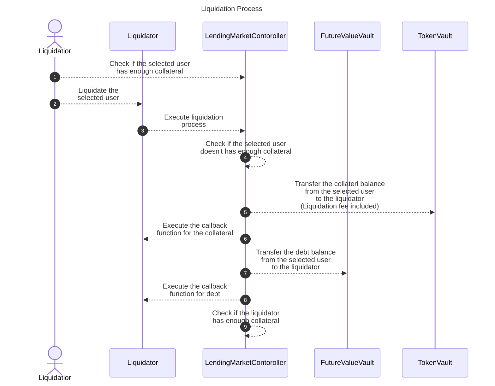

# ✏️ How Liquidation Works

## Overview

The liquidation process in the Fixed-Rate Lending Protocol involves identifying undercollateralized positions and executing liquidation calls through smart contract functions. This technical guide explains the implementation details of how liquidation works from a developer's perspective.


## How It Works

First of all, it is necessary to identify the target user through off-chain actions before executing liquidation. The function `getCoverage()` is used for this purpose. A user becomes a target for liquidation if this function returns a value of `8000` or higher. For more details, refer to the documentation at [TokenVault Documentation](https://github.com/Secured-Finance/contracts/blob/develop/docs/protocol/TokenVault.md#getcoverage).

To execute with liquidation, you must specify the currency of the collateral to be received, the currency of the debt to be liquidated, and its maturity. This is done by calling the function `executeLiquidationCall()`. To maximize the profit of the liquidation in the case that users have collateral or debt in multiple currencies, you need to estimate each case and choose one of them through off-chain action. For more details of the function, refer to the documentation at [LendingMarketController Documentation](https://github.com/Secured-Finance/contracts/blob/develop/docs/protocol/LendingMarketController.md#executeliquidationcall).

Upon executing this process, the liquidator receives the liquidated debt and the collateral plus a 5% fee. However, if the liquidator's collateral coverage exceeds 80% at the end of the process, this liquidation process will fail.

When executing the liquidation process through a smart contract, functions `executeOperationForCollateral()` for receiving collateral, and `executeOperationForDebt()` for receiving debt, can be set as callback functions. For usage, please refer to the sample contract at [Liquidator Contract](https://github.com/Secured-Finance/contracts/blob/develop/contracts/external/liquidation/Liquidator.sol).

During the liquidation process, these callback functions enable the handling of received collateral by swapping it through external services or unwinding the received debt. The process flow is as follows:



## Key Parameters

| Parameter | Description | Value |
|-----------|-------------|-------|
| Coverage Threshold | The threshold value returned by `getCoverage()` that makes a position eligible for liquidation | 8000 |
| Liquidation Fee | The additional collateral received by the liquidator | 5% |
| Liquidator Coverage Limit | Maximum coverage value a liquidator can have after liquidation | 80% |
| Callback Functions | Functions that can be implemented to handle received assets | `executeOperationForCollateral()`, `executeOperationForDebt()` |

## Examples

### Example 1: Identifying Positions for Liquidation

A liquidator bot wants to find undercollateralized positions:

```javascript
// Pseudocode for a liquidator bot
async function findLiquidationTargets() {
  const users = await getAllUsers();
  const liquidationTargets = [];
  
  for (const user of users) {
    // Check if user's position is undercollateralized
    const coverage = await tokenVault.getCoverage(user.address);
    
    // If coverage is 8000 or higher, the position is eligible for liquidation
    if (coverage >= 8000) {
      // Calculate potential profit from liquidation
      const collateralValue = await getCollateralValue(user.address);
      const debtValue = await getDebtValue(user.address);
      const liquidationFee = collateralValue * 0.05; // 5% fee
      
      liquidationTargets.push({
        user: user.address,
        coverage,
        collateralValue,
        debtValue,
        potentialProfit: liquidationFee
      });
    }
  }
  
  // Sort by potential profit to prioritize most profitable liquidations
  return liquidationTargets.sort((a, b) => b.potentialProfit - a.potentialProfit);
}
```

### Example 2: Executing a Liquidation Call

A liquidator wants to liquidate an undercollateralized position:

```javascript
// Pseudocode for executing liquidation
async function executeLiquidation(targetUser) {
  // Determine which collateral and debt currencies to liquidate
  const collateralCurrency = findMostProfitableCollateral(targetUser);
  const debtCurrency = findMostEfficientDebt(targetUser);
  const maturity = getCurrentMaturity();
  
  // Execute the liquidation call
  const tx = await lendingMarketController.executeLiquidationCall(
    targetUser,
    collateralCurrency,
    debtCurrency,
    maturity
  );
  
  // Handle the received collateral and debt
  // This will trigger the callback functions if implemented
  await tx.wait();
  
  // Check if liquidation was successful
  const liquidatorCoverage = await tokenVault.getCoverage(liquidatorAddress);
  if (liquidatorCoverage > 8000) {
    console.log("Liquidation failed: Liquidator coverage exceeded 80%");
  } else {
    console.log("Liquidation successful");
  }
}
```

## FAQ

### How do I determine which collateral and debt currencies to liquidate?

You should analyze all possible combinations of collateral and debt currencies for a target user and choose the one that maximizes your profit. This typically involves:

1. Fetching all collateral and debt positions for the user
2. Calculating the potential profit for each combination (collateral value × 1.05 - debt value)
3. Considering gas costs for each liquidation
4. Selecting the combination with the highest net profit

### What happens if a user has multiple collateral types?

If a user has multiple collateral types, you can only liquidate one collateral type per liquidation call. You would need to make separate liquidation calls for each collateral type you want to liquidate. It's generally most profitable to start with the collateral type that has the highest value or the one with the highest liquidation fee relative to its debt.

### Can I implement my own liquidation strategy?

Yes, you can implement custom liquidation strategies by creating your own smart contract that inherits from the base Liquidator contract. You can override the callback functions `executeOperationForCollateral()` and `executeOperationForDebt()` to implement custom logic for handling the received assets, such as immediately swapping them on a DEX or using them for other DeFi strategies.

### What prevents a liquidator from liquidating healthy positions?

The protocol checks if the target user's position is undercollateralized by calling `getCoverage()`. If this function returns a value less than 8000, the liquidation call will revert. Additionally, the protocol checks if the liquidator's own position would become too collateralized after the liquidation (coverage > 80%), which prevents liquidators from accumulating too much collateral relative to their debt.

### How can I test my liquidation bot before deploying it to mainnet?

You can test your liquidation bot on a testnet or in a forked mainnet environment. To create test scenarios:

1. Set up a test account with collateral and debt positions
2. Manipulate the price oracle to simulate price movements that would make positions undercollateralized
3. Execute your liquidation bot against these test positions
4. Verify that the liquidation was successful and that you received the expected collateral and fee

## Related Resources

- [Liquidators](README.md)
- [Liquidation Process](../../README.md)
- [Mark to Market](../../mark-to-market.md)
- [Collateral Liquidations](../../collateral-liquidations/README.md)
