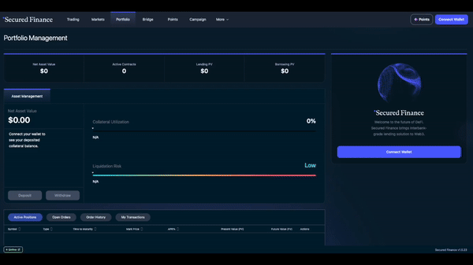

# Quick Start: Borrow

Borrowing on Secured Finance means **selling a Zero-Coupon (ZC) bond**: you receive funds today and repay the bond's face value at maturity. Your borrowing cost is fixed at execution — no floating-rate surprises.

**You'll need:** a Web3 wallet, collateral assets, and a small amount of the network's native token for gas.

## Step 1 — Connect and deposit collateral

1. Open [app.secured.finance](https://app.secured.finance/) and click **Connect Wallet**.
2. Go to the **Portfolio** tab and click **Deposit**.
3. Deposit an accepted collateral asset (see [Collateral](../core-concepts/collateral.md) for the list per network) and confirm in your wallet.

Borrowing requires **over-collateralization** — your collateral must be worth significantly more than the amount you borrow. Current thresholds are listed in [Protocol Parameters](../protocol-parameters.md).

<!-- screenshot: portfolio-deposit-collateral -->
<figure><figcaption>
Depositing collateral (previous app UI)
</figcaption></figure>

## Step 2 — Choose a market

1. Open the **Fixed Income** tab (the trading interface).
2. Select the currency you want to borrow and a maturity date (quarterly — the last Friday of Mar/Jun/Sep/Dec).
3. Check the current borrow rate on the order book.

## Step 3 — Place your borrow order

1. Select **Borrow**.
2. Pick an order type:
   * **Market order** — fills immediately at the best available price. A taker fee applies (see [Fees](../core-concepts/fees.md)).
   * **Limit order** — you set your maximum rate and wait to be matched. **Limit orders pay no fee.**
3. Enter the amount, review the implied APR, repayment amount at maturity, and collateral usage, then click **Place Order**.
4. Confirm in your wallet. Borrowed funds are credited to your protocol account, ready to withdraw or reuse.

<!-- screenshot: place-borrow-order -->

## Step 4 — Watch your position health

After borrowing, monitor your **collateral coverage** in the Portfolio tab:

* Your position can be **liquidated** if your Loan-to-Value ratio reaches the liquidation threshold (see [Liquidation](../core-concepts/liquidation/README.md)).
* Both a fall in collateral value **and** a rise in the borrowed asset's value push your LTV up.
* To reduce risk: deposit more collateral, or reduce the borrow — unwind it, or place an opposite (lend) order for part of the amount ([Managing Positions](managing-positions.md)).

## Step 5 — Repaying (important)


There is **no automatic settlement**. At maturity your debt is automatically rolled into the nearest 3-month market (**Auto-Roll** — protocol-wide, not configurable), and the rolled debt accrues the new market rate plus a roll fee. To close your debt, **unwind the position manually**: Portfolio → select the position → **Unwind** (buy back the bond).


| You want to… | Do this |
| --- | --- |
| Extend the loan at the new market rate | Nothing — Auto-Roll handles it (roll fee applies) |
| Repay and close | **Unwind** the position, then withdraw remaining collateral |
| Repay part of the loan | Place an opposite (lend) **order** for the amount to repay — filled amounts net against your debt ([Managing Positions](managing-positions.md)) |

## Troubleshooting

* **"Insufficient collateral" error** — deposit more collateral, reduce the borrow amount, or check the asset's haircut in [Protocol Parameters](../protocol-parameters.md).
* **Order not filling** — your limit rate may be below market; adjust it or use a market order.
* **Unwind blocked** — order book liquidity may be thin at an acceptable price; wait for liquidity and retry, or place an opposite (lend) **limit order** at your acceptable price.

## Next steps

* [Collateral](../core-concepts/collateral.md) — accepted assets and haircuts per network
* [Liquidation](../core-concepts/liquidation/README.md) — thresholds, fees, and how to stay safe
* [Managing Your Positions](managing-positions.md) — day-to-day position management
