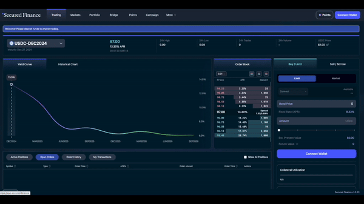

# Quick Start: Lend

Lending on Secured Finance means **buying a Zero-Coupon (ZC) bond at a discount** — you pay less than face value today, and the position is worth full face value at maturity. The difference is your yield, locked in at execution.

**You'll need:** a Web3 wallet, assets to lend, and a small amount of the network's native token for gas.

## Step 1 — Connect and deposit

1. Open [app.secured.finance](https://app.secured.finance/) and click **Connect Wallet**.
2. Go to the **Portfolio** tab and click **Deposit**.
3. Choose the asset and amount you want to lend, then confirm in your wallet.

<!-- screenshot: portfolio-deposit -->

## Step 2 — Choose a market

1. Open the **Fixed Income** tab (the trading interface).
2. Select the currency and the maturity date. Markets mature quarterly — the last Friday of March, June, September, and December.
3. Check the current yield for that maturity on the order book, or compare maturities on the [Stats](https://app.secured.finance/stats/) yield curve.

## Step 3 — Place your lend order

1. Select **Lend**.
2. Pick an order type:
   * **Market order** — fills immediately at the best available price. A taker fee applies (see [Fees](../core-concepts/fees.md)).
   * **Limit order** — you set the price (rate) and wait to be matched. **Limit orders pay no fee.**
3. Enter the amount, review the implied APR and estimated fee, and click **Place Order**.
4. Confirm in your wallet.

<!-- screenshot: place-lend-order -->
<figure><figcaption>
Placing a lend order on the order book (previous app UI)
</figcaption></figure>

## Step 4 — What happens next

* **Filled order** → you now hold a ZC bond position, visible in **Portfolio → Active Positions**. Its value accrues toward face value (100) as maturity approaches.
* **Open limit order** → it stays on the order book until matched, canceled, or the market matures. Track it under **Open Orders**.

## Step 5 — At maturity (important)


There is **no automatic settlement**. At maturity your position is automatically rolled into the nearest 3-month market (**Auto-Roll** — a protocol-wide mechanism that cannot be configured or disabled). If you want your funds back instead, **unwind your position manually**: Portfolio → select the position → **Unwind**. You can unwind at any time before or after maturity, subject to market liquidity.


Your three options as maturity approaches:

| You want to… | Do this |
| --- | --- |
| Keep earning at the new market rate | Nothing — Auto-Roll handles it (a roll fee applies, see [Fees](../core-concepts/fees.md)) |
| Exit and withdraw | **Unwind**, then **Withdraw** from Portfolio |
| Move the position elsewhere | Tokenize it as a [ZC Token](../core-concepts/tokenization.md) (ERC-20) |

## Troubleshooting

* **Limit order not filling** — your rate may be off-market; adjust the price, or use a market order for immediate execution.
* **Transaction fails** — check that you hold native tokens for gas and have sufficient deposited balance.
* **Unwind blocked or partially filled** — the order book may lack liquidity at an acceptable price (see [Circuit Breaker](../advanced-topics/circuit-breaker.md)); wait for liquidity and retry, or place an opposite (borrow) **limit order** at your acceptable price — filled amounts net against your position.

## Next steps

* [Managing Your Positions](managing-positions.md) — add, reduce, unwind
* [Fixed Maturity & Auto-Roll](../core-concepts/fixed-maturity-and-auto-roll.md) — how quarterly markets work
* [Zero-Coupon Bonds](../core-concepts/zero-coupon-bonds.md) — price ↔ APR mechanics
