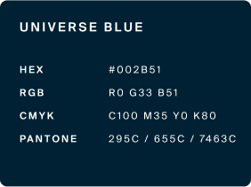
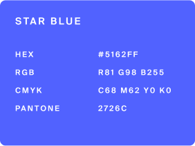

# 🎨 Brand Assets


This page is evolving. Additional assets will be added as required.


Welcome to Secured Finance's comprehensive logo usage guide. Our logo is a visual representation of our brand's identity, and its consistent application is crucial in conveying a cohesive brand identity. This guide offers detailed instructions to ensure our logo is used correctly and consistently.

***

## Primary Logo Versions

The Secured Finance logo has been meticulously designed with two primary versions to ensure adaptability across various backgrounds:

<table data-card-size="large" data-view="cards"><thead><tr><th></th><th></th><th></th><th data-hidden data-type="files"></th><th data-hidden data-card-cover data-type="files"></th></tr></thead><tbody><tr><td><strong>Dark Version</strong></td><td>Crafted for light backgrounds, this version retains the logo's clarity and ensures it doesn't get lost amidst lighter shades. </td><td><strong>Usage:</strong> Ideal for light backgrounds like whites, pastels, or soft shades.</td><td><a href="broken-reference">Broken link</a></td><td><a href="../../.gitbook/assets/logo-primary-light-bg.png">logo-primary-light-bg.png</a></td></tr><tr><td><strong>Light Version</strong></td><td>This version has been optimized for dark backgrounds, ensuring that the logo remains vibrant and stands out.</td><td><strong>Usage:</strong> Primarily for dark backgrounds, such as deep blues, blacks, or rich colors.</td><td><a href="broken-reference">Broken link</a></td><td><a href="../../.gitbook/assets/logo-primary-dark-bg.png">logo-primary-dark-bg.png</a></td></tr></tbody></table>

### **Color Specification**

Ensure that the colors are accurately represented in all applications to maintain brand consistency.

_Note for Printing:_ When using Pantone colors, ensure accurate representation. If specific Pantone shades are unavailable or unsuitable for a particular print medium, use the provided alternate Pantone colors or consult the Hex, CMYK, and RGB references.

<figure><figcaption></figcaption></figure> <figure><figcaption></figcaption></figure> <figure><figcaption></figcaption></figure>

***

### **Reverse Version**

For situations where full-color production isn't feasible, the reverse version of the logo is recommended.

<table data-card-size="large" data-view="cards"><thead><tr><th></th><th></th><th></th><th data-hidden data-card-cover data-type="files"></th></tr></thead><tbody><tr><td><strong>Monochromatic Dark Version</strong></td><td><strong>Color</strong>: Knockout Black</td><td><strong>Description</strong>: This version is optimized for light backgrounds, ensuring the logo remains distinct and clear.</td><td><a href="../../.gitbook/assets/monochromatic-dark.png">monochromatic-dark.png</a></td></tr><tr><td><strong>Monochromatic Light Version</strong></td><td><strong>Color:</strong> Knockout White</td><td><strong>Description</strong>: Crafted for darker backgrounds, this version ensures the logo stands out prominently.</td><td><a href="../../.gitbook/assets/monochromatic-light.png">monochromatic-light.png</a></td></tr></tbody></table>

***

### **S Logo**

The "S Logo" is a distilled representation of the Secured Finance brand, encapsulating its essence in a compact form. Designed with a sphere encompassing a prominent "S", this logo variant is tailored for applications where space is limited or where a simplified brand mark is required. Its minimalist design ensures immediate recognition, making it ideal for app icons, favicons, and other digital touchpoints where clarity and quick brand recall are paramount.

**Centering the S Logo:**\
The "S Logo" is a unique blend of the letter "S" and an accentuating sphere. When positioning the logo, the centering should be based around the "S" as it's the primary element, with the sphere serving as a complementary accent. This means that the visual weight and focus should be on the "S", ensuring it occupies the central position in any design or application.

<table data-card-size="large" data-column-title-hidden data-view="cards"><thead><tr><th></th><th data-hidden data-card-cover data-type="files"></th></tr></thead><tbody><tr><td><strong>S Logo Dark Version</strong></td><td><a href="../../.gitbook/assets/S-logo-light-bg.png">S-logo-light-bg.png</a></td></tr><tr><td><strong>S Logo Light Version</strong></td><td><a href="../../.gitbook/assets/S-logo-dark-bg.png">S-logo-dark-bg.png</a></td></tr></tbody></table>

***

### Co-Branding

In collaborative or partnership scenarios with Secured Finance, our brand's distinctiveness and recognition are paramount.

* For co-branding efforts, the preferred choice is the full horizontal wordmark logo of Secured Finance. This extended layout ensures our brand name remains clearly visible and maintains its prominence, even when placed alongside other logos.
* It's essential that the Secured Finance logo stands its ground. It should neither be overshadowed nor dominated by other entity logos. The goal is to achieve equal prominence, reflecting a true collaborative spirit while upholding our brand's integrity.

<table data-card-size="large" data-column-title-hidden data-view="cards"><thead><tr><th></th><th data-hidden data-card-cover data-type="files"></th></tr></thead><tbody><tr><td>Collaboration Example 1</td><td><a href="../../.gitbook/assets/oxford.png">oxford.png</a></td></tr><tr><td>Collaboration Example 2</td><td><a href="../../.gitbook/assets/ethglobal.png">ethglobal.png</a></td></tr></tbody></table>

***

### **Positioning and Clear Space**

To maintain the logo's integrity and readability:

* Ensure a minimum area of isolation around the Secured Finance logo. This space should be equivalent to the height of the 'S' in the Secured Finance signature. Always respect this space for clarity and prominence.
* Avoid placing the logo too close to other text, graphics, or images.

<figure><figcaption>
Clear Space Guideline
</figcaption></figure>

***

### Colour Palette and Colour Ratio Guideline

Ensure that the colours are adhered to when designing marketing assets. The colours can be mixed in different combinations, but care should be taken to ensure that secondary colours that are meant to be highlights are used sparingly. \
\
Main brand colour: Star Blue #5162FF\
Main background colour: Universe Blue (Black) #002133

<figure><figcaption>
Colour Palette: This is the guide to show exactly which hues can be used. 
</figcaption></figure>

<figure><figcaption>
Colour Ratio: This is the guide to show the proportion of hues that should be used relative to one another.
</figcaption></figure>

<figure><figcaption>
Backgrounds: This is the guide to show which hues can be used on backgrounds on marketing assets.
</figcaption></figure>

***

### Download the brand asset pack

**Includes:** Secured Finance logos in dark and light versions and a variety of formats print and online usage.



#### Maintaining the integrity of the Secured Finance Logo


**Usage guidelines - please read before use**

When applying the Secured Finance logo please follow these simple rules:

* **Separation:** Do not separate the sphere from the text from the logo.&#x20;
* **Distortion:** Do not stretch, condense, skew, rotate, or otherwise distort the logo.
* **Scale:** Do not selectively scale or change the proportions of any element of the logo.
* **Color:** Do not recolor the logo.
* **Font:** Do not redraw the logo using another typeface for the wordmark.
* **Contrast:** Use sufficient contrast when placing the logo over a background image.
* **Legibility:** Ensure the logo is legible (re. size and surrounding space)
* **Outline:** Don't add an outline/stroke to the logo
* **Background:** Use the correct color (full color, knockout, or one color) for light vs. dark backgrounds


### File format guide

SVG

SVGs (Scalable Vector Graphics) can be scaled up or down in size without any loss of detail. Often used for logos, icons and vector based illustrations.

**When to use:**

* **Websites/Apps** - ensure branding looks perfect on all screens
* **Illustrations** - small file sizes and easily editable
* **Animation** - SVGs can be animated

PNG

PNGs (Portable Network Graphics) are raster based images. PNGs can be saved at as hi-res images but increasing the size of a PNG will reduce the overall quality of the image. A benefit of using PNGs (instead of JPGs) is that they support transparent and semi-transparent backgrounds.

**When to use:**

* When a SVG cannot be uploaded eg. on 3rd party apps

EPS / PDF

These formats are used for print and in Adobe apps. All these formats are vector based and scalable.

**When to use:**

* **EPS** - often requested by printers especially for swag printing
* **PDF** - a format that's independent of software, hardware or OS. Fonts can be embedded in PDFs. Best format for providing print-ready files

***

### **Conclusion**

Thank you for adhering to these guidelines. By doing so, you help maintain the strength and consistency of the Secured Finance brand. If you have any questions or need further clarification, please contact [official@secured-finance.com](mailto:official@secured-finance.com).
