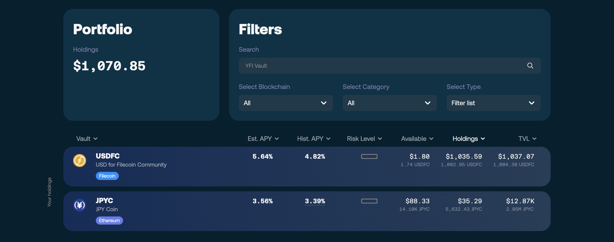
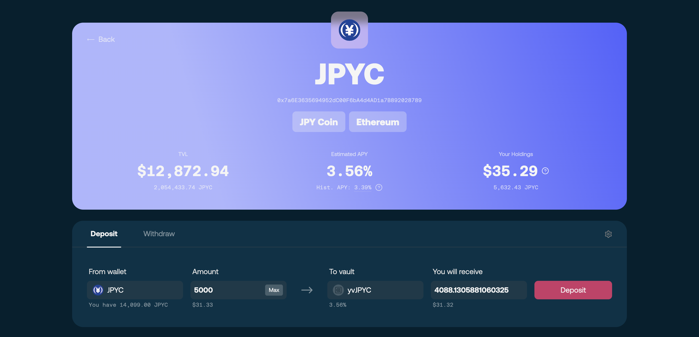
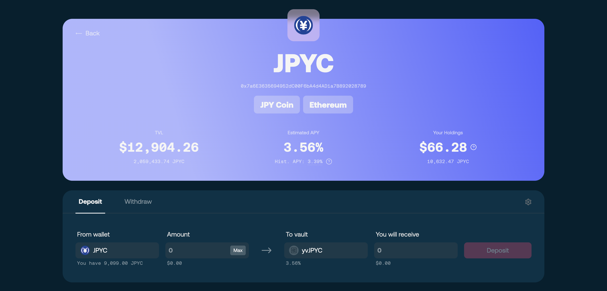

# 💴 Deposit assets

Depositing into a vault mints **vault shares** to your wallet — your claim on the vault's assets, whose value changes with strategy performance. How shares work is covered in [Vault System Overview](../core-mechanics/vault-system-overview.md); this page is the hands-on walkthrough.

Before you start, make sure:

* Your wallet is connected to the right network (Ethereum for JPYC, Filecoin for USDFC)
* You hold the vault's base asset, plus a little native token for gas


**A vault is not a savings account.** Returns are variable and not guaranteed — the value of your position can decrease if the strategy takes losses. Review the strategy's risk notes and the [Risk Disclaimer](../../resources/legal/risk-disclaimer.md), and deposit only what fits your risk tolerance.


## Step 1 — Connect your wallet

Open the [**SF Yield Vault app**](https://vaults.secured.finance/) and click **Connect Wallet** — either in the top-right corner or in the **Portfolio** card — then approve the connection. Your address and balances appear once connected.

<figure><figcaption>
Connecting your wallet
</figcaption></figure>

## Step 2 — Select a vault

Pick the vault for your asset — for example, **JPYC Vault**.

<figure><figcaption>
Selecting a vault
</figcaption></figure>

## Step 3 — Enter the amount

Enter how much you want to deposit and review the estimated vault shares you will receive.

## Step 4 — Approve the asset

If the amount exceeds what you have previously approved, the app shows **Approve** first. Click it and confirm in your wallet. Approvals are granted for the exact amount, so this step typically appears before each new deposit.

<figure><figcaption>
Approving the asset
</figcaption></figure>

## Step 5 — Confirm the deposit

Once approved, the same button turns into **Deposit**. Click it and confirm in your wallet — when the transaction finalizes, your vault shares are credited.

<figure><figcaption>
Confirming the deposit
</figcaption></figure>

## What happens next

Your position appears in the app and yield starts accruing automatically — no further action needed. Your share count stays the same; it is the **value per share** that grows as the strategy earns.

<figure><figcaption>
Your position after depositing
</figcaption></figure>

## Troubleshooting

* **Approve succeeds but Deposit stays disabled** — refresh the page and re-check the amount against your balance and any deposit limit shown.
* **Transaction pending for a long time** — network congestion; wait, or speed the transaction up in your wallet.
* **Asset not showing in the app** — confirm the wallet is on the vault's network (Ethereum for JPYC, Filecoin for USDFC).

## Related

* [Withdraw assets](withdrawing-assets.md) — redeeming shares for the underlying asset
* [Manage your position](managing-position.md) — what to watch after depositing
* [Vault System Overview](../core-mechanics/vault-system-overview.md) — how shares and accounting work
