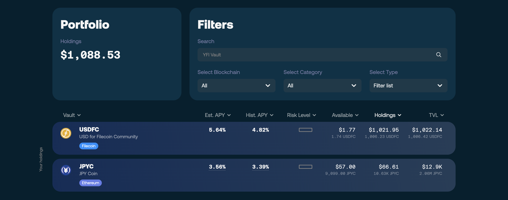
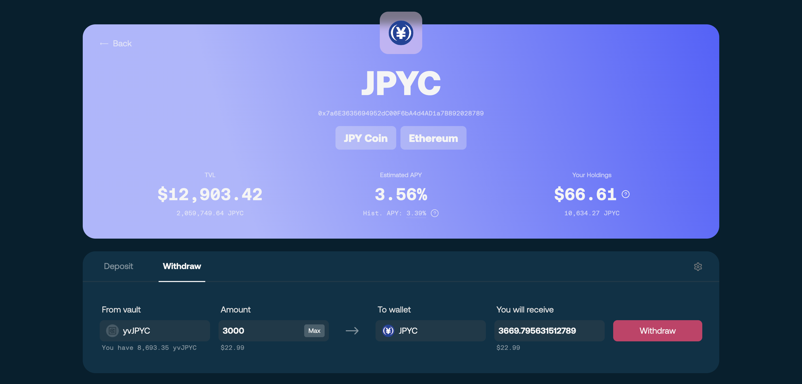
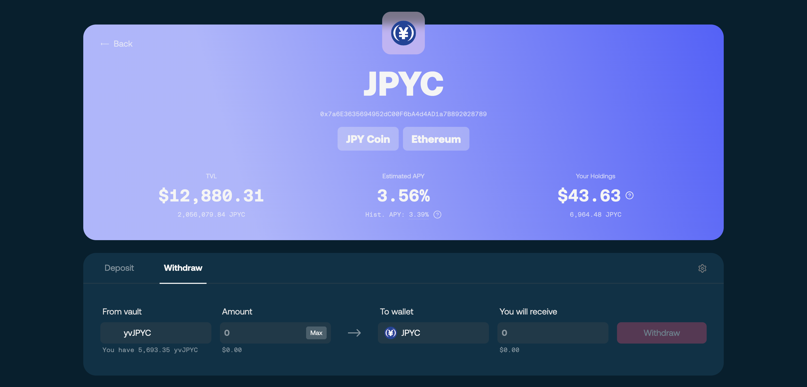

# 💰 Withdraw assets

Withdrawing means redeeming your **vault shares** for the vault's base asset. What you receive depends on the **price per share** at the moment of withdrawal — more than you deposited if yield has accrued, less if the strategy has taken losses.

There is no lock-up or fixed term, but withdrawals depend on liquidity available in the strategy: if the underlying market cannot absorb the unwind, the withdrawal transaction reverts and no funds move — you can try a smaller amount, or try again once liquidity recovers. See [Strategy Framework and Allocation Model](../core-mechanics/strategy-framework-and-allocation-model.md#liquidity-and-withdrawals).

## Step 1 — Connect your wallet

Open the [**SF Yield Vault app**](https://vaults.secured.finance/) and click **Connect Wallet** — either in the top-right corner or in the **Portfolio** card — connecting the wallet that holds your position. Your active positions appear once connected. You will need a little of the network's native token (ETH on Ethereum, FIL on Filecoin) for gas.

<figure><figcaption>
Connecting your wallet
</figcaption></figure>

## Step 2 — Select your vault

Select the vault you deposited into and switch to the **Withdraw** tab.

<figure><figcaption>
Selecting the vault you deposited into
</figcaption></figure>

## Step 3 — Enter the amount

Enter how much to withdraw — a partial amount or your full position. **Max** fills in the largest amount you can safely withdraw right now: slightly below the vault's current liquidity limit, so the transaction does not fail on rounding. This may be less than your full balance when strategy liquidity is short. The app shows the estimated amount of the base asset you will receive at the current price per share.

## Step 4 — Confirm the withdrawal

Click **Withdraw** and confirm in your wallet.

<figure><figcaption>
Confirming the withdrawal
</figcaption></figure>

## What happens next

Your shares are redeemed, the vault frees assets from the strategy, and the base asset arrives in your wallet once the transaction finalizes. Partial withdrawals do not affect the rest of your position: any shares you keep stay invested and remain exposed to strategy performance, gaining or losing value with it.

<figure><figcaption>
Your position after withdrawing
</figcaption></figure>

## Troubleshooting

* **Max fills in less than your balance** — normally Max fills in your full balance; when it fills in less, the vault cannot release your full position right now. Withdraw the suggested amount, or try again once liquidity recovers.
* **Withdrawal reverts** — strategy liquidity is temporarily short; try a smaller amount, or try again once liquidity recovers.
* **Received amount differs from the estimate** — the price per share moved between the estimate and execution; small differences are normal.
* **Position not visible** — confirm you are connected with the depositing address on the vault's network.

## Related

* [Manage your position](managing-position.md) — deciding when to withdraw
* [Vault System Overview](../core-mechanics/vault-system-overview.md) — how redemption and accounting work
* [FAQs](../faqs.md#withdrawals) — common withdrawal questions
