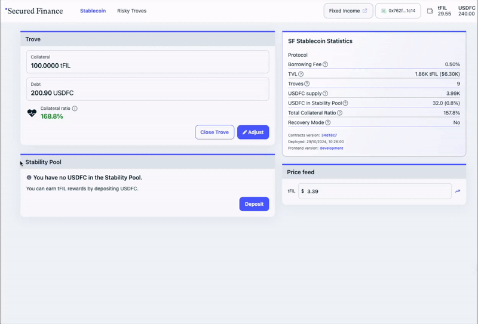

# 🧙 Beginners Guide

## 3 Steps for Minting USDFC

1. Connect Wallet
2. Open Trove and Deposit FIL
3. Mint USDFC!!

<figure><figcaption></figcaption></figure>

## Where is my Money?

1. After successfully 'Open Trove', you will see your USDFC on top right corner.&#x20;
2. Your USDFC is already in your connected wallet address. To see it in your wallet such as MetaMask, you should import the USDFC tokens. The USDFC contract address can be found [here](https://docs.secured.finance/stablecoin-protocol-guide/technical-resources#contract-addresses).

<figure><figcaption>
Importing USDFC token into your MetaMask wallet
</figcaption></figure>

## How can I get back my collateral?

You can 'Close Trove' to repay entire debt or 'Adjust' your balance to withdraw your collateral whenever you want!

<figure><figcaption></figcaption></figure> <figure><figcaption>
'Adjust' your postion!
</figcaption></figure>

## What you can do with USDFC

After minting USDFC, you have many options, including pledge into the 'Stability Pool', 'Provide Liquidity for DEX', 'Lend USDFC through the Secured Finance Fixed Income Market', 'Cross-Chain Swap for the payment', and more!&#x20;

### 1. Stability Pool

<figure><figcaption></figcaption></figure>

Deposit your USDFC into the Stability Pool to help secure the protocol. You’ll receive a portion of liquidated FIL in return with discount.

### 2. LP for DEX

Pair your USDFC with FIL and LP into the 'SushiSwap Pool' to earn trading fees.

### 3. Lend through Fixed-Income market

You can lend your USDFC in Secured Finance’s [Fixed Income Market](https://app.secured.finance/) and earn interest from borrowers.

### 4. Cross-Chain Bridge and Swap

You can easily [bridge and swap](https://usdfc.secured.finance/#/bridge) USDFC from FVM to currency on other chains powered by Axelar.

## Test Token Faucet for Calibration testnet

You can obtain tFIL Test Token Faucet from [here](https://faucet.calibnet.chainsafe-fil.io/funds.html?__cf_chl_tk=s4qPXZxIycwMt7dhs4eZcCQTqmMxYU5ESo2U_vXGls0-1729835939-1.0.1.1-wV4DTkou6_RlkwxQR_7u3qyXuW05tvyyz0uIiieVgIQ). See more details through [Filecoin Docs](https://docs.filecoin.io/smart-contracts/developing-contracts/get-test-tokens).
