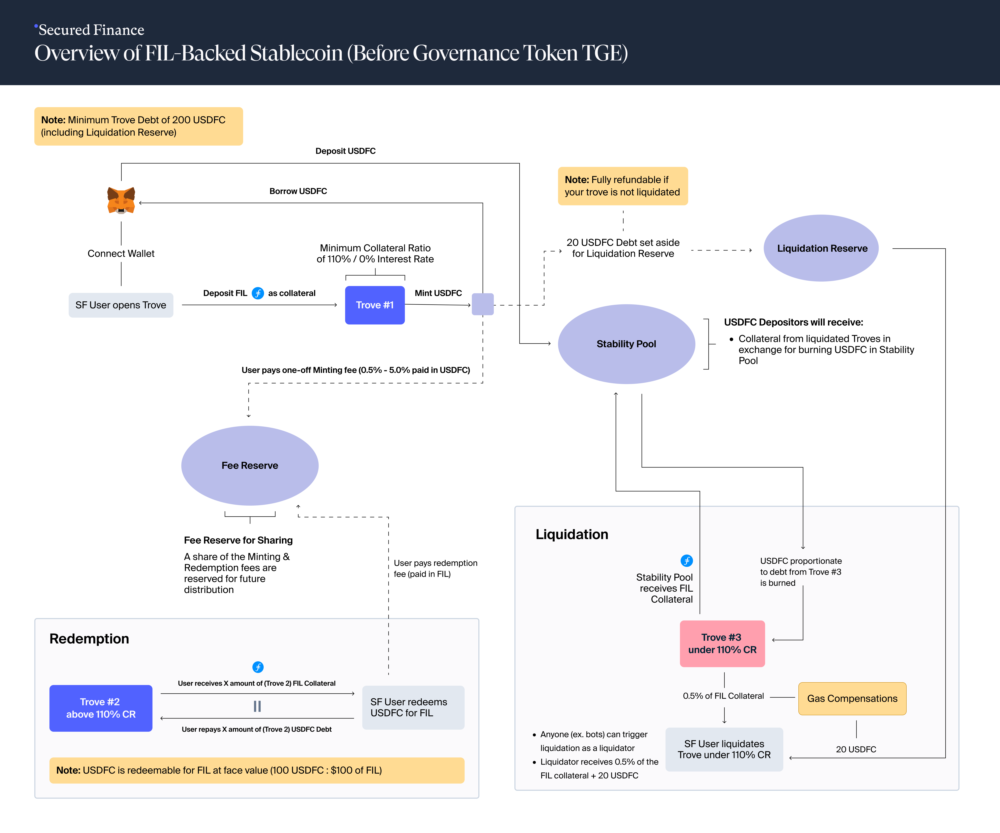

# Community Resources

## Video

[Demo at FIL Dev Summit 2024](https://www.youtube.com/watch?v=LOnCu4HZnXg\&list=PL_0VrY55uV1__uv3uOvZ3L6exG9y10lSy\&index=13) (testnet)

## User Guide

Secured Finance Stablecoin (USDFC) on the Calibration Testnet ([EN](https://medium.com/secured-finance/secured-finance-stablecoin-usdfc-on-the-calibration-testnet-6447f05cbfbf), and [CN](https://medium.com/secured-finance/secured-finance%E7%A8%B3%E5%AE%9A%E5%B8%81-usdfc-calibration%E6%B5%8B%E8%AF%95%E7%BD%91%E9%93%B8%E9%80%A0%E6%8C%87%E5%8D%97-129c443cebc4))

## Architecture Diagram

### Normal Mode

<figure><figcaption></figcaption></figure>

### Recovery Mode

<figure><figcaption></figcaption></figure>

