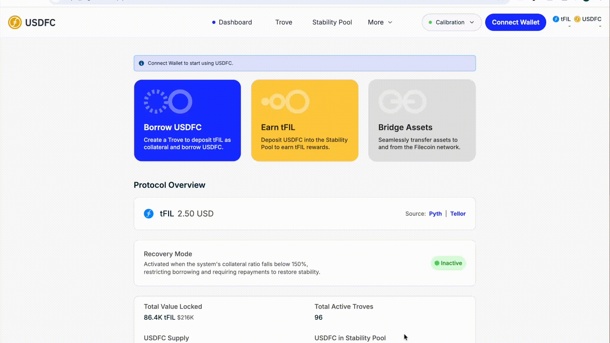

# ⛽ Creating Your First Trove

A **Trove** is your personal collateralized debt position: you lock FIL in it and mint USDFC against it. Each address can have one Trove at a time.

Before you start, make sure:

* Your wallet is connected to **Filecoin Mainnet**
* You hold enough FIL for the collateral you plan to deposit, plus a little for gas

<figure><figcaption>
Quick walkthrough of this step
</figcaption></figure>

## Step 1 — Connect your wallet

Open the [USDFC app](https://app.usdfc.net), click **Connect Wallet** in the top-right corner, and pick your wallet provider (MetaMask, WalletConnect, etc.).

<figure><figcaption>
The wallet connection dialog
</figcaption></figure>

## Step 2 — Open the Trove page

Go to the **Trove** page. Since you don't have a Trove yet, you'll see the creation form.

<figure><figcaption>
The Trove creation form
</figcaption></figure>

## Step 3 — Set collateral and borrow amounts

Enter how much FIL to deposit and how much USDFC to borrow. The app calculates your **collateral ratio** as you type.

* The minimum you can borrow is **200 USDFC**.
* The minimum collateral ratio is **110%** (150% while the system is in [Recovery Mode](../core-mechanics/recovery-mode.md)), but leave yourself a buffer — the app labels ratios below 150% as elevated risk and 200%+ as very low risk.
* Your **Total debt** will be: borrowed amount + one-time [borrowing fee](../core-mechanics/protocol-fees.md) (0.5% or more) + 20 USDFC **Liquidation Reserve**, which is refunded when you close the Trove.

<figure><figcaption>
Collateral and borrow inputs with the live collateral ratio
</figcaption></figure>

## Step 4 — Confirm

Review the amounts, fee, and resulting ratio, then click **Create Trove and Borrow USDFC** and confirm in your wallet. The USDFC you requested is sent to your wallet in full — the fee and reserve are added to your debt, not deducted from what you receive.

<figure><figcaption>
Review screen before the Create Trove and Borrow USDFC transaction
</figcaption></figure>

## Step 5 — Verify

Once the transaction confirms, your Trove appears on the dashboard and the USDFC lands in your wallet balance.

<figure><figcaption>
A newly created Trove on the dashboard
</figcaption></figure>


**USDFC not showing in your wallet?** On the Dashboard, find "Add USDFC to Wallet" and click **Click here** — or add it manually with the address from [Contracts and Security](../deployed-contracts.md).


## Troubleshooting

* **Create Trove and Borrow USDFC is disabled** — the borrow amount is below 200 USDFC, the ratio is below the minimum, or you don't have enough FIL for the collateral plus gas.
* **Transaction reverts** — the FIL price may have moved while you were reviewing; refresh and check the ratio again. During Recovery Mode, new Troves need 150%+.
* **Trove not showing after confirmation** — wait for the transaction to finalize, then refresh; check it on [Filfox](https://filfox.info/en) if in doubt.

## Where next

* [Mint additional USDFC](minting-usdfc-step-by-step.md) from the same Trove
* [Manage your collateral](managing-collateral-effectively.md) and understand the ratio thresholds
* [Monitor your position](monitoring-your-position.md) so a FIL price drop doesn't catch you off guard — if your ratio falls below 110%, your Trove can be [liquidated](../core-mechanics/liquidation.md)
