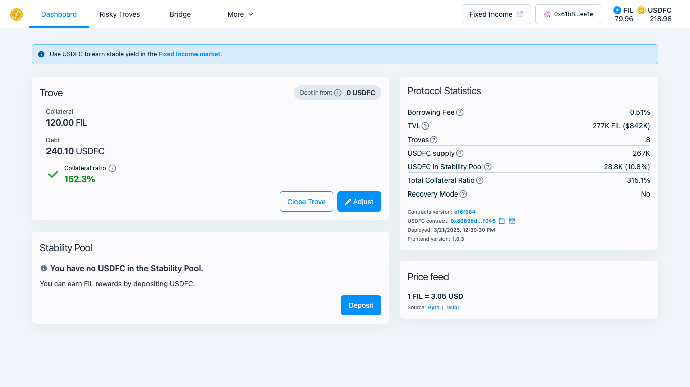

# 🧪 Getting Test USDFC on Testnet

## Overview

This tutorial guides you through the process of obtaining and using test USDFC on the Filecoin Calibration testnet. Testing on the testnet allows you to experiment with USDFC's features without using real assets. You'll learn how to:

* Obtain test Filecoin (tFIL) from a faucet
* Access the USDFC testnet application
* Mint test USDFC using tFIL as collateral
* Add test USDFC to your wallet

## Prerequisites

* A web3 wallet (like MetaMask) installed and have your wallet address
* Basic understanding of blockchain transactions

## Step 1: Get Test Filecoin (tFIL) from the Faucet

Before minting test USDFC, you'll need test Filecoin (tFIL) to use as collateral.

1. Visit the Filecoin Calibration testnet faucet at [https://faucet.calibnet.chainsafe-fil.io/funds.html](https://faucet.calibnet.chainsafe-fil.io/funds.html)
2. Enter your wallet address
3. Complete any verification steps required by the faucet
4. Request tFIL — the faucet dispenses about 100 tFIL per request and limits how often you can request
5. Wait for the transaction to complete (this usually takes a few minutes)

<figure><figcaption>
Filecoin Calibration testnet faucet interface
</figcaption></figure>

## Step 2: Access the USDFC Testnet Application

The USDFC testnet application is separate from the mainnet application.

1. Go to the USDFC testnet application at [https://stg-legacy.usdfc.net/](https://stg-legacy.usdfc.net/)
2. Connect your wallet by clicking the "Connect Wallet" button in the top right corner
3. Ensure your wallet is set to the Filecoin Calibration testnet network

<figure><figcaption>
USDFC testnet application page with adding Calibration network
</figcaption></figure>

> **Note:** The testnet application (https://stg-legacy.usdfc.net/) is different from the mainnet application (https://legacy.usdfc.net/). Make sure you're using the correct URL for testing.

## Step 3: Mint Test USDFC Using tFIL

Now that you have tFIL and are connected to the testnet application, you can mint test USDFC.

1. On the USDFC testnet application, navigate to the "Trove" section and click "Open Trove"
2. Enter the amount of tFIL you want to use as collateral
3. The application will calculate the amount of USDFC you can mint based on your collateral
4. Adjust the collateral ratio as needed (higher ratios provide more protection against liquidation)
5. Confirm the transaction in your wallet
6. Wait for the transaction to be confirmed on the blockchain

<figure><figcaption>
Minting USDFC
</figcaption></figure>

## Step 4: Add Test USDFC to Your Wallet

After minting, you'll want to see your test USDFC in your wallet.

1. On the Dashboard page, navigate to the "Protocol Statistics" section and find "USDFC contract.
2. Click "Add to Wallet" icon.
3. The token symbol (USDFC) and decimals should be added
4. Click "Add" or "Import" to add test USDFC to your wallet ([video](https://gyazo.com/4102e760883c7c413ee1161a851d5712))

<figure><figcaption>
Adding USDFC to Wallet
</figcaption></figure>

## Step 5: Closing Your Trove

Most cases, 'Adjust' should allow withdrawing collateralized FIL, but if you no longer need to use USDFC system, you can close your trove and you can reopen a trove again.


Don't forget to repay the borrowing fees. If you wish to close the trove with the USDFC amount you just borrowed, it doesn't work. You should repay borrowing fees. Please get additional USDFC from another account or via swap.


1. On the Dashboard page, navigate to the "Trove" section
2. Click "Close Trove" button
3. If you see error message that you need more USDFC to pay borrowing fees, please get it.
4. If you just wish to withdraw FIL as much as possible, you can cancel closing and click "Adjust"
5. Click "Confirm" to send the transaction with your wallet

<figure><figcaption>
Closing Your Trove requires repayment of the borrowed amount and fees in USDFC
</figcaption></figure>

## Using Test USDFC on Testnet

Now that you have test USDFC, you can explore various features of the USDFC ecosystem on testnet:

### Stability Pool

You can deposit your test USDFC into the Stability Pool to help secure the protocol and potentially earn rewards from liquidations. Learn more with [using-the-stability-pool.md](using-the-stability-pool.md "mention")

<figure><figcaption>
Stability Pool
</figcaption></figure>

### Fixed Rate Lending Market

While Bridge and SushiSwap features are not available on testnet, you can use the USDFC fixed rate lending market.

1. Visit [http://stg.secured.finance/?chain\_id=314159](http://stg.secured.finance/?chain_id=314159)
2. Connect your wallet
3. Navigate to the lending markets
4. Explore lending or borrowing with your test USDFC. Learn more with [quick-start-lend.md](../../../fixed-rate-lending/getting-started/quick-start-lend.md "mention") and [quick-start-borrow.md](../../../fixed-rate-lending/getting-started/quick-start-borrow.md "mention")

## Testnet Limitations

It's important to understand the differences between testnet and mainnet:

* **Bridge functionality** is not available on testnet
* **SushiSwap integration** is not available on testnet
* Test tokens have no real-world value
* Transaction times and network behavior may differ from mainnet
* The USDFC fixed rate lending market is available at [https://stg.secured.finance](http://stg.secured.finance/?chain_id=314159)

## Common Questions

**Q: How often can I request test FIL from the faucet?**\
A: Faucet limitations vary, but typically you can request once every 24 hours.

**Q: Are there any fees for transactions on testnet?**\
A: Yes, you'll need to pay gas fees in tFIL, but since tFIL has no real value, these fees are effectively free.

**Q: Can I transfer my test USDFC to mainnet?**\
A: No, testnet tokens cannot be transferred to mainnet as they exist on separate networks.

**Q: What should I do if my transaction fails?**\
A: Check that you have enough tFIL for gas fees, ensure your wallet is connected to the Filecoin Calibration testnet, and try again with a higher gas limit if necessary.

## Related Resources

* [USDFC Overview](../../overview.md)
* [Creating Your First Trove](creating-your-first-trove.md)
* [Minting USDFC Step-by-Step](minting-usdfc-step-by-step.md)
* [Using the Stability Pool](using-the-stability-pool.md)
