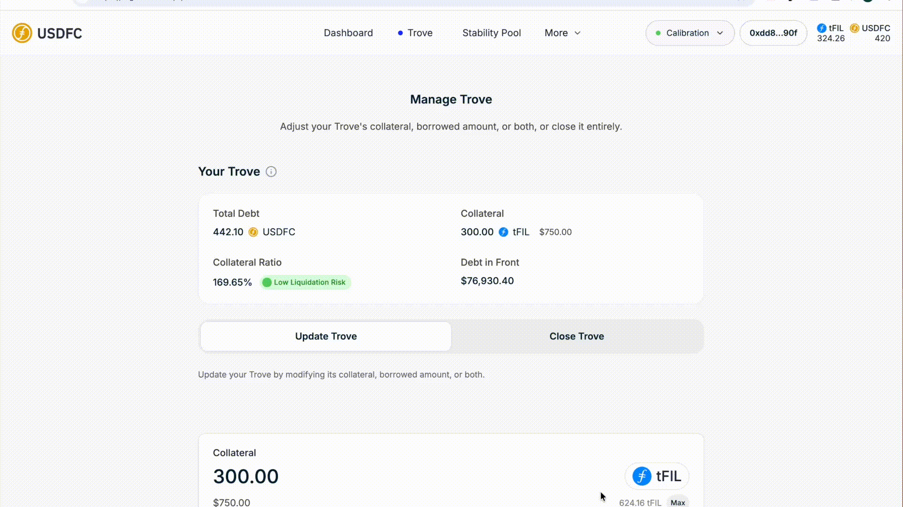

# 🤝 Managing Collateral Effectively

Your collateral ratio is what stands between your Trove and liquidation. This guide covers adjusting collateral in the app and choosing a ratio that fits your risk tolerance.

<figure><figcaption>
Quick walkthrough of this step
</figcaption></figure>

## Step 1 — Open your Trove

In the [USDFC app](https://app.usdfc.net), go to the **Trove** page and review your current collateral, debt, and ratio.

<figure><figcaption>
Your current position on the Trove page
</figcaption></figure>

## Step 2 — Open the Update Trove form

With an open Trove, the **Update Trove** tab is already selected when you land on the Trove page — the adjustment form shows your current collateral and debt.

<figure><figcaption>
The Update Trove form
</figcaption></figure>

## Step 3 — Adjust the collateral amount

In the **Collateral** field, enter the new total:

* **To add:** increase the FIL amount. Your ratio rises and your liquidation price falls. Adding collateral costs only gas — no protocol fee.
* **To withdraw:** decrease the FIL amount. The transaction will revert if it would push your ratio below 110% (and no collateral can be withdrawn while the system is in [Recovery Mode](../core-mechanics/recovery-mode.md)). Withdrawing also costs only gas.

<figure><figcaption>
Adding collateral
</figcaption></figure>

<figure><figcaption>
Withdrawing collateral
</figcaption></figure>

## Step 4 — Confirm and verify

Click **Update Trove**, confirm in your wallet, and check the updated position. Withdrawn FIL goes straight to your wallet balance.

<figure><figcaption>
Wallet confirmation
</figcaption></figure>

<figure><figcaption>
Updated Trove details
</figcaption></figure>

## Choosing a collateral ratio

The app classifies your ratio the same way it displays risk:

| Ratio | App label | Approx. FIL drop before reaching 110% |
| --- | --- | --- |
| 200% and above | Very Low risk | 45% or more |
| 150% to under 200% | Low risk | 27% – 45% |
| 120% to under 150% | Medium risk | 8% – 27% |
| Below 120% | High risk | Less than 8% |
| Below 110% | — | Eligible for [liquidation](../core-mechanics/liquidation.md) |

The drop figures assume Normal Mode and unchanged collateral and debt; during Recovery Mode, liquidation can start at the system's total ratio (up to 150%).

Two numbers worth knowing by heart:

* **110%** — the Minimum Collateral Ratio. Below it, your Trove can be liquidated.
* **150%** — the system-wide threshold. If the *total* collateral ratio of all Troves falls below it, [Recovery Mode](../core-mechanics/recovery-mode.md) begins and Troves below that total ratio (up to 150%) can be liquidated too.

Your **liquidation price** — the FIL price at which your Trove hits 110% — is:

$$
\text{Liquidation Price} = \frac{\text{Debt in USDFC} \times 1.1}{\text{Collateral in FIL}}
$$


There is no ratio that removes risk entirely — a deep enough FIL drop can threaten any Trove. Decide how closely you can realistically monitor the market, and size your buffer to match. See the [Risk Disclaimer](../../resources/legal/risk-disclaimer.md).


## Troubleshooting

* **Withdrawal reverts** — the new ratio would fall below 110%, the system is in Recovery Mode, or the withdrawal would push the system-wide ratio below 150%. Withdraw less, or add collateral first.
* **Update Trove is disabled** — check that the amounts changed and that your wallet has enough FIL for gas.
* **Ratio didn't update after the transaction** — refresh the page; the app re-reads your Trove on load.

## Repaying debt and closing your Trove

* **Partial repayment** — in the **Update Trove** form, reduce the **Borrowed Amount** by the USDFC you want to repay and click **Update Trove**. Net debt (excluding the 20 USDFC reserve) must stay at or above 200 USDFC. Repaying has no fee.
* **Closing** — open the **Close Trove** tab and click **Repay & Close Trove**. You repay your total debt minus the 20 USDFC reserve, and all collateral returns to your wallet. Because the borrowing fees are part of your debt, you need slightly more USDFC than you originally minted — the difference has to come from a swap, another account, or Stability Pool gains swapped into USDFC.
* **When closing is refused** — during [Recovery Mode](../core-mechanics/recovery-mode.md), or when closing would push the system's total collateral ratio below 150%. Partial repayment still works in both cases.

## Where next

* [Monitor your position](monitoring-your-position.md) — thresholds only help if you're watching them
* [Recovery Mode](../core-mechanics/recovery-mode.md) — what changes when the whole system is under-collateralized
