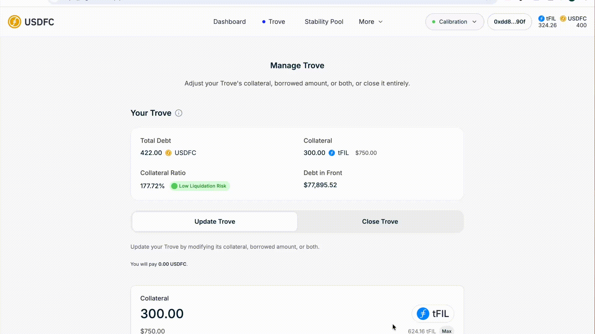

# 👛 Minting USDFC Step-by-Step

If you already have a Trove, you can mint more USDFC against it whenever your collateral ratio stays above the minimum (110% in Normal Mode, and the system-wide ratio must stay at or above 150%; during [Recovery Mode](../core-mechanics/recovery-mode.md) the Trove must end at 150% or higher and its ratio must not fall). You'll need your Trove open and some FIL for gas.

<figure><figcaption>
Quick walkthrough of this step
</figcaption></figure>

## Step 1 — Open your Trove

In the [USDFC app](https://app.usdfc.net), go to the **Trove** page. You'll see your current collateral, debt, and collateral ratio.


**Debt** shown here is your current total debt: borrowed amount + borrowing fees + the 20 USDFC Liquidation Reserve, adjusted for any repayments, redemptions, or debt redistributed to your Trove from liquidations.


<figure><figcaption>
Your current position on the Trove page
</figcaption></figure>

## Step 2 — Enter the additional amount

With an open Trove, the **Update Trove** tab is already selected when you land on the Trove page. Increase the **Borrowed Amount** by the extra USDFC you want to mint (you can adjust collateral in the same transaction). The app shows your new collateral ratio as you type.

* A one-time [borrowing fee](../core-mechanics/protocol-fees.md) (0.5% or more of the newly minted amount; waived in Recovery Mode) is added to your debt.
* Minting without adding collateral lowers your ratio — check where it lands before confirming. The app flags ratios below 150% as risky.

<figure><figcaption>
The Update Trove form with the new amounts and resulting ratio
</figcaption></figure>

## Step 3 — Confirm

Click **Update Trove** and confirm in your wallet. The newly minted USDFC is sent to your wallet in full; the fee is added to your debt.

<figure><figcaption>
Confirming the Update Trove transaction
</figcaption></figure>

## Step 4 — Verify

Your Trove's debt updates and the new USDFC appears in your wallet. If it doesn't show, refresh the page or check the transaction on [Filfox](https://filfox.info/en).


For each borrowing operation, your wallet receives the requested amount and your debt increases by that amount plus the borrowing fee. When you close the Trove you don't repay the Liquidation Reserve, but the fees stay owed.


<figure><figcaption>
Updated Trove details and wallet balance
</figcaption></figure>

## Troubleshooting

* **Update Trove is disabled** — the new ratio would fall below 110%, or (in Recovery Mode) the adjustment doesn't leave the Trove at 150%+ without lowering its ratio.
* **Transaction reverts** — the FIL price may have moved; refresh and re-check the resulting ratio before confirming again.
* **USDFC not in your wallet** — add the token via "Add USDFC to Wallet" on the Dashboard, or check the transaction on Filfox.

## Where next

* [Manage your collateral](managing-collateral-effectively.md) if the new ratio is tighter than you'd like
* [Monitor your position](monitoring-your-position.md) — more debt means a higher liquidation price
* [Deposit into the Stability Pool](using-the-stability-pool.md) to put the minted USDFC to work
