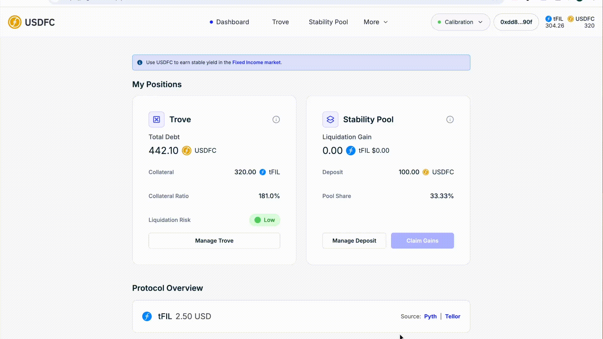

# 🏦 Monitoring Your Position

A Trove is not a set-and-forget position: FIL moves, and your collateral ratio moves with it. This guide covers what to watch and how to stay ahead of liquidation.

<figure><figcaption>
Quick walkthrough of this step
</figcaption></figure>

## Step 1 — Check the Dashboard

The **Dashboard** page of the [USDFC app](https://app.usdfc.net) shows your Trove and Stability Pool positions alongside protocol-wide statistics.

**My Positions**

| Item | What it means |
| --- | --- |
| Total Debt | Everything you owe: borrowed USDFC + accumulated borrowing fees + the 20 USDFC Liquidation Reserve |
| Collateral | FIL locked in your Trove |
| Collateral Ratio | Collateral value ÷ Total Debt — see below |
| Liquidation Risk | The app's label for your ratio: Very Low (200%+), Low (150–<200%), Medium (120–<150%), High (<120%) |
| Liquidation Gain | FIL credited to you from liquidations, waiting to be claimed |
| Deposit | Your remaining USDFC in the Stability Pool (it shrinks as liquidations consume it) |
| Pool Share | Your deposit as a share of the whole pool — your cut of every liquidation |

**Protocol Overview**

| Item | What it means |
| --- | --- |
| FIL price / Source | The FIL/USD price the protocol is using and which oracle it comes from — see [Price Oracle](../core-mechanics/price-oracle.md) |
| Recovery Mode | Whether the system is in [Recovery Mode](../core-mechanics/recovery-mode.md) (Active / Inactive) |
| Total Value Locked | All FIL collateral in the protocol |
| Total Active Troves | Number of open Troves |
| USDFC Supply | Total USDFC in circulation |
| USDFC in Stability Pool | How much of the supply is backing liquidations (and the percentage) |
| Borrowing Fee | The fee you'd pay to mint right now — 0.5% + Base Rate, capped at 5%; 0.00% during Recovery Mode |
| Total Collateral Ratio | The system-wide ratio. Below 150% triggers Recovery Mode, and during Recovery Mode Troves below this number can be liquidated |

<figure><figcaption>
The Dashboard with your position and protocol statistics
</figcaption></figure>

## Step 2 — Know your metrics

The Trove page shows your collateral, debt, collateral ratio, liquidation risk, and debt in front. One number worth tracking — your liquidation price — is **not** displayed, so calculate it yourself from the figures shown.

<figure><figcaption>
Your Trove metrics as shown in the app
</figcaption></figure>

### Collateral Ratio

The value of your collateral relative to your debt — the single most important number for your Trove:

$$
\text{Collateral Ratio} = \frac{\text{Collateral Value in USD}}{\text{Debt in USDFC}} \times 100\%
$$

The app labels the ranges: **200% and above** very low risk, **150% to under 200%** low, **120% to under 150%** medium, **below 120%** high. Below **110%**, your Trove is eligible for [liquidation](../core-mechanics/liquidation.md) — and during [Recovery Mode](../core-mechanics/recovery-mode.md), Troves below the **system's total ratio** (up to 150%) can be liquidated.

### Liquidation Price (calculate this yourself)

Not shown in the app. It is the FIL price at which your Trove reaches 110%:

$$
\text{Liquidation Price} = \frac{\text{Debt in USDFC} \times 1.1}{\text{Collateral in FIL}}
$$

Compare it to the current FIL price on the Dashboard to see your real buffer.

### Debt in front

Shown on the Trove page: the total debt of Troves with lower collateral ratios than yours. [Redemptions](redeeming-usdfc.md) hit the lowest-ratio Troves first, so a small "debt in front" means your Trove is near the front of the redemption queue — being redeemed doesn't charge you a fee (the collateral removed matches the debt reduction at the oracle price), but it converts your collateral to debt reduction whether you wanted it or not. Raising your ratio moves you back in the queue.

### Recovery Mode

Not a metric but a state: when the system enters Recovery Mode, the app displays a prominent notice on the Dashboard — you don't need an external source to know.

## Step 3 — Set up price alerts

The app doesn't send notifications, so put an alert where you'll see it:

1. Calculate your liquidation price.
2. Set a FIL price alert comfortably above it (for example 20–30% above) in whatever tracking app or exchange you already use.
3. Treat the alert as the trigger to act — add collateral or repay — not as the moment to start thinking about it.

## Step 4 — Match your check-in rhythm to your risk

* **Ratio below 150%:** check daily, and during volatile markets, intraday. Keep FIL ready to add on short notice.
* **Ratio 150–200%:** check weekly and after any sharp FIL move.
* **Ratio above 200%:** less frequent checks are reasonable, but keep the price alert in place and re-check after any sharp FIL move or a Recovery Mode notice — and consider whether the idle buffer could be smaller.

When FIL falls, your options are to **add collateral** or **repay debt** ([Update Trove](managing-collateral-effectively.md)) — both raise your ratio. When FIL rises, you can withdraw excess collateral or [mint more USDFC](minting-usdfc-step-by-step.md), at the cost of a thinner buffer.

## Where next

* [Managing Collateral Effectively](managing-collateral-effectively.md) — the mechanics of adjusting your position
* [Redeeming USDFC](redeeming-usdfc.md) — what redemption means for Trove owners
* [Recovery Mode](../core-mechanics/recovery-mode.md) — the rules that apply system-wide
