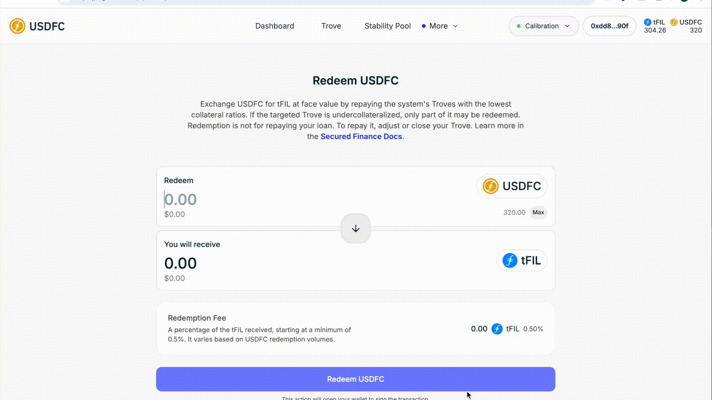

# 💸 Redeeming USDFC

Redemption lets any USDFC holder exchange USDFC for $1 worth of FIL directly from the protocol — this arbitrage path is what anchors the peg. The FIL comes from the Troves with the lowest collateral ratios, so redemption is also something Trove owners want to understand from the receiving end. You'll need USDFC in your wallet and FIL for gas.


**Redemption is not repayment.** Repaying reduces *your own* Trove's debt (via Update Trove). Redeeming reduces whichever Troves have the lowest collateral ratios in the system — you don't get to choose, and it isn't a way to pay down your own debt. If you own a Trove, watch your **Debt in front** figure and keep your ratio up to stay further back in the redemption queue.


<figure><figcaption>
Quick walkthrough of this step
</figcaption></figure>

## Step 1 — Open the Redeem page

In the [USDFC app](https://app.usdfc.net), open the **More** tab and select **Redeem USDFC**.

<figure><figcaption>
Redeem USDFC in the More tab
</figcaption></figure>

## Step 2 — Review the current conditions

Check the current [redemption fee](../core-mechanics/protocol-fees.md) — it's **0.5% + the Base Rate**, and the Base Rate rises with each redemption and decays over time. If a large redemption just happened, waiting for the rate to decay can save you money.

<figure><figcaption>
Redemption conditions
</figcaption></figure>

## Step 3 — Enter the amount

Enter how much USDFC to redeem. The app shows the FIL you'll receive at the current oracle price, minus the fee.

<figure><figcaption>
The lowest collateral ratio Troves are redeemed against first
</figcaption></figure>

## Step 4 — Confirm

Click **Redeem USDFC** and confirm in your wallet.

<figure><figcaption>
Reviewing the redemption details
</figcaption></figure>

## Step 5 — Verify

Your USDFC balance decreases and the FIL arrives in your wallet. On-chain, the affected Troves' debt and collateral both shrink by the corresponding amounts; a Trove that is redeemed in full is closed, and its owner can claim the remaining collateral from the app.

<figure><figcaption>
Wallet balances after redemption
</figcaption></figure>

<figure><figcaption>
The lowest-ratio Trove's collateral and debt were reduced
</figcaption></figure>

## When redemption makes sense

* **USDFC trades below $1 by more than the fee and transaction costs** — buy cheap, redeem at face value, pocket the difference. This is the arbitrage that helps restore the peg.
* **You want FIL, not USDFC** — redemption converts at the oracle price without a DEX spread, though the redemption fee applies.

Redemption is **not** the cheapest exit if you have your own Trove — repaying your own debt has no fee at all.


Redemptions are unavailable while the system's total collateral ratio is below 110%. Troves that are themselves below 110% are skipped by redemption — they're left for [liquidation](../core-mechanics/liquidation.md) instead.


## Troubleshooting

* **Redeem USDFC is disabled** — the system's total collateral ratio is below 110%, or you have no USDFC in the connected wallet.
* **You received less FIL than expected** — the redemption fee (0.5% + Base Rate) is deducted in FIL; a recent large redemption raises the Base Rate.
* **Only part of the amount was redeemed** — the redemption stops before any partial redemption that would leave a Trove below the 200 USDFC minimum; the unprocessed USDFC stays in your wallet. Try a slightly different amount.

## Where next

* [Redemption](../core-mechanics/redemption.md) — the full mechanics, including how the Base Rate moves
* [Monitoring Your Position](monitoring-your-position.md) — how Trove owners track their place in the redemption queue
