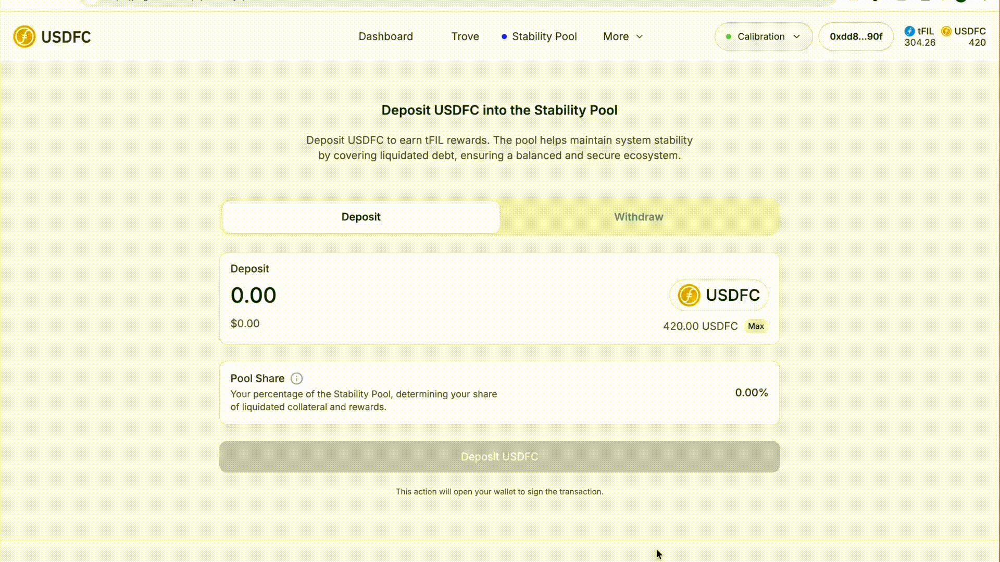

# 🏊 Using the Stability Pool

The Stability Pool is the protocol's first line of defense: when a Trove is liquidated, USDFC from the pool repays its debt and the Trove's FIL collateral is distributed to depositors. Because a Trove is liquidated as soon as it falls below 110%, its collateral is normally still worth more than its debt — so depositors typically acquire that FIL at a discount to market price. You'll need USDFC in your wallet and FIL for gas.

<figure><figcaption>
Quick walkthrough of this step
</figcaption></figure>

## Step 1 — Open the Stability Pool page

In the [USDFC app](https://app.usdfc.net), go to the **Stability Pool** page. Pool-wide statistics (total deposits and your share) are also visible in the **Protocol Overview** section of the Dashboard.

<figure><figcaption>
The Stability Pool page and protocol statistics
</figcaption></figure>

## Step 2 — Deposit USDFC

Enter the amount to deposit, click **Deposit USDFC**, and confirm in your wallet. There is no deposit fee and no minimum, though very small deposits may not justify the gas.

<figure><figcaption>
The deposit form
</figcaption></figure>

## Step 3 — Watch your deposit work

Liquidation gains accrue only when liquidations happen, so don't expect steady drip income — activity clusters around FIL price drops. Two numbers change over time:

* **Your deposit** shrinks as its share of USDFC is used to repay liquidated debt.
* **Your liquidation gain** (FIL) grows as you receive your share of seized collateral.

This is a conversion, not a loss: your USDFC becomes FIL, usually at a discount, since a liquidated Trove hands over more than $1 of collateral per $1 of debt repaid. Note the flip side — you're accumulating a volatile asset, and its price can fall after you receive it.

<figure><figcaption>
Deposit and liquidation gains on the Stability Pool page
</figcaption></figure>

## Step 4 — Claim your FIL gains

On the Stability Pool page, click **Claim FIL** and confirm in your wallet (the same action appears as **Claim Gains** on the Dashboard). The FIL is sent to your wallet balance; your remaining USDFC deposit stays in the pool.

## Step 5 — Withdraw when you want

Click **Adjust** on your deposit, switch to the **Withdraw** tab, and enter the amount to withdraw (the app caps it at your current deposit). Click **Withdraw USDFC** and confirm. The USDFC plus any unclaimed FIL gains go to your wallet.


There is no lockup, but withdrawals are temporarily suspended whenever there are Troves below 110% that haven't been liquidated yet — the pool has to do its job first. You can withdraw once those liquidations clear.


<figure><figcaption>
Withdrawing from the Stability Pool
</figcaption></figure>

## How your share is calculated

When a liquidation occurs, both the debt repayment and the collateral gain are split across depositors pro rata:

$$
\text{Your Gain} = \text{Liquidated Collateral} \times \frac{\text{Your Deposit}}{\text{Total Stability Pool}}
$$

The same fraction of your deposit is consumed to repay the liquidated debt. Everything is automatic — there's nothing to trigger or compound manually.

## Troubleshooting

* **Withdraw USDFC is disabled or reverts** — there are Troves below 110% waiting to be liquidated; withdrawals reopen once they clear.
* **Claim FIL is greyed out** — no liquidation has credited your deposit yet; gains only appear after liquidations occur.
* **My deposit is smaller than what I put in** — expected: part of it was used to repay liquidated debt, and the corresponding FIL is in your liquidation gain.

## Where next

* [Liquidation](../core-mechanics/liquidation.md) — the full mechanics behind the gains
* [Recovery Mode](../core-mechanics/recovery-mode.md) — liquidations extend to Troves below the system ratio (up to 150%) during Recovery Mode, which typically means more pool activity
* [Redeeming USDFC](redeeming-usdfc.md) — a different way to convert USDFC to FIL
